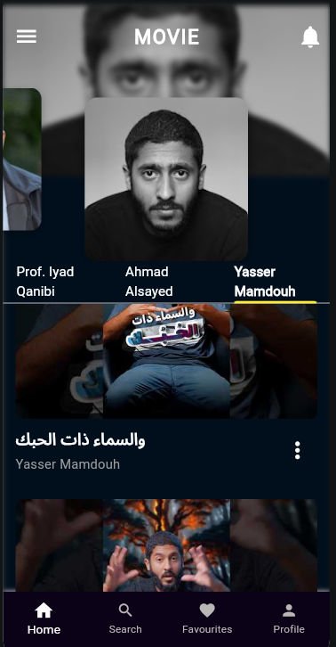
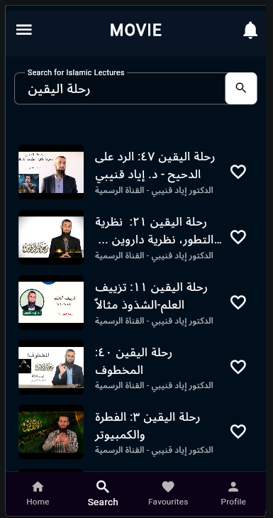
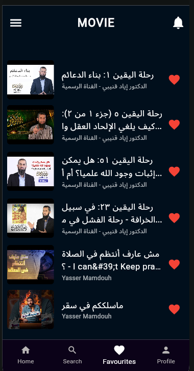
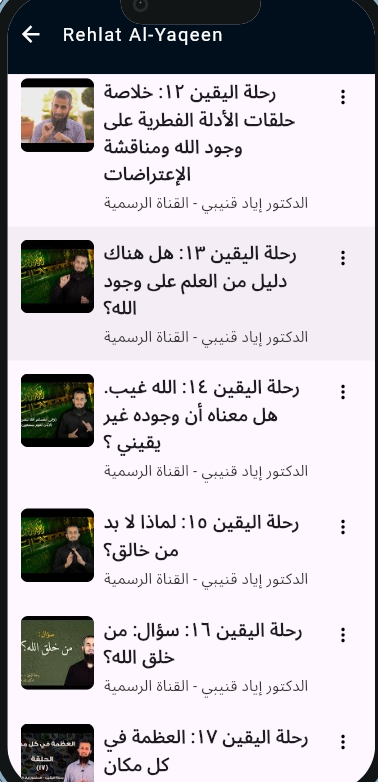
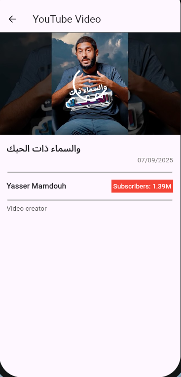

# Watch App 📱📺

[](https://flutter.dev/)
[](https://dart.dev/)
[](https://bloclibrary.dev/)
[](LICENSE)

A high-performance, responsive Flutter application engineered for streaming educational content. This project showcases **production-grade architecture**, **complex state management**, and **adaptive UI design** optimized for both mobile and tablet form factors.

<br>
<hr>

## 📑 Table of Contents

- [🔭 Overview](#-overview)
- [🚀 Key Features](#-key-features)
- [✨ Architecture & Design](#-architecture--design)
- [📦 Technology Stack](#-technology-stack)
- [📸 Screenshots](#-screenshots)
- [🛠️ Project Structure](#-project-structure)
- [🏁 Installation & Setup](#-installation--setup)
- [📞 Contact](#-contact)

<br>
<hr>

## 🔭 Overview

The **Watch App** is more than just a video player; it's a demonstration of scalable Flutter development. It integrates seamlessly with the YouTube Data API to provide a curated viewing experience. The app features a custom-built synchronization engine that coordinates tab navigation, carousel sliders, and page views for a fluid user experience.

<br>
<hr>

## 🚀 Key Features

*   **Adaptive Responsive Layouts**: 
    *   Intelligent scaling for **Small, Medium, and Large Mobile** screens.
    *   Dedicated layouts for **Tablets** (Small to Large) ensuring content density is optimized.
*   **Advanced State Management (Bloc/Cubit)**: 
    *   Separation of business logic from UI using Cubits.
    *   `VideoCubit` handles asynchronous API calls, pagination, and error states.
    *   `HomePageCubit` and `FavouritePageCubit` manage local application state.
*   **Synchronized UI Navigation**: Custom logic in `HomePage.dart` ensures smooth transitions between Tabs, Carousels, and PageViews without jitter or state desync.
*   **YouTube API Integration**: 
    *   Efficient fetching of Channel details, Playlists, and Videos.
    *   Pagination support for infinite scrolling.
*   **Developer Tooling**: Integrated `device_preview` to simulate various screen sizes and notches during development.

<br>
<hr>

## ✨ Architecture & Design

The project follows **Clean Architecture** principles to ensure maintainability and testability:

1.  **Core Layer**: Contains global utilities, constants targeting API keys (`AppConstants`), theme definitions (`AppTheme`), and routing logic.
2.  **Back-End Layer**: Encapsulates all business logic.
    *   **Cubits**: Manage state changes and emit new states to the UI.
    *   **Repositories**: (Implicit) handle data fetching from APIs.
3.  **Front-End Layer**: Pure UI components that listen to state changes.
    *   **Widgets**: Reusable components like `VideoListWidget`, `TabBarWidget`.
    *   **Pages**: screens constructed from widgets.

<br>
<hr>

## 📦 Technology Stack

| Domain | Package | Purpose |
| :--- | :--- | :--- |
| **Core** | `flutter` | UI Toolkit |
| **Logic** | `flutter_bloc`, `bloc` | Predictable State Management |
| **Network** | `http` | API Consumption |
| **Media** | `youtube_player_flutter` | Embedded Video Playback |
| **UI/UX** | `carousel_slider` | Dynamic Header Banners |
| **Utils** | `device_preview` | Responsive Testing |
| **Assets** | `flutter_launcher_icons` | App Icon Management |
| **Image** | `cached_network_image` | Efficient Image Loading & Caching |

<br>
<hr>

## 📸 Screenshots

| Home Page | Search Page | Favorites Page | Playlist View | Video Player |
| :---: | :---: | :---: | :---: | :---: |
|  |  |  |  |  |

<br>
<hr>

## 🛠️ Project Structure

```bash
lib/
├── back_end/             # Business Logic (Cubits, Models)
│   ├── home_page/
│   ├── favourite_page/
│   └── ...
├── core/                 # App-wide configurations
│   ├── utils/            # Constants, Themes, Router
│   └── widgets/          # Shared Widgets (Backgrounds, Loaders)
├── front_end/            # Presentation Layer
│   ├── home_page/        # Home Screen & sub-widgets
│   └── ...
└── main.dart             # Application Entry Point
```

<br>
<hr>

## 🏁 Installation & Setup

1.  **Clone the Repository**
    ```bash
    git clone https://github.com/mahmoudjawad-2025/1--Flutter--Watch_App.git
    cd 1--Flutter--Watch_App
    ```

2.  **Install Dependencies**
    ```bash
    flutter pub get
    ```

3.  **Configure API Keys**
    *   Open `lib/core/utils/AppConstants.dart`.
    *   Ensure valid YouTube Data API keys are present in `apiKey`, `apiKey2`, etc.

4.  **Run the Application**
    ```bash
    flutter run
    ```
    *   *Tip*: To see the device preview, run in debug mode or change `enabled: !kReleaseMode` in `main.dart` to `true`.

<br>
<hr>


## 📞 Contact

📧 mahmoudjawad02025@gmail.com

🔗 GitHub: [mahmoudjawad-2025](https://github.com/mahmoudjawad-2025/)
